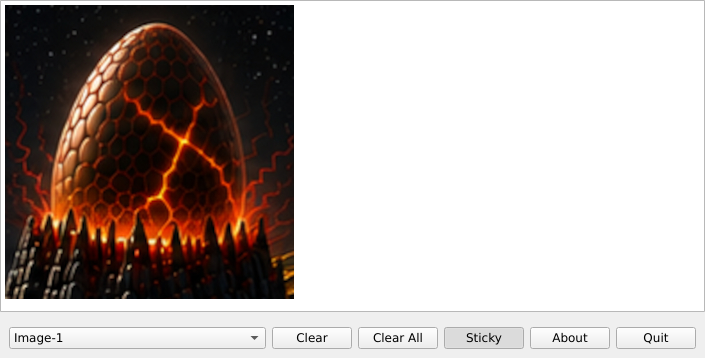
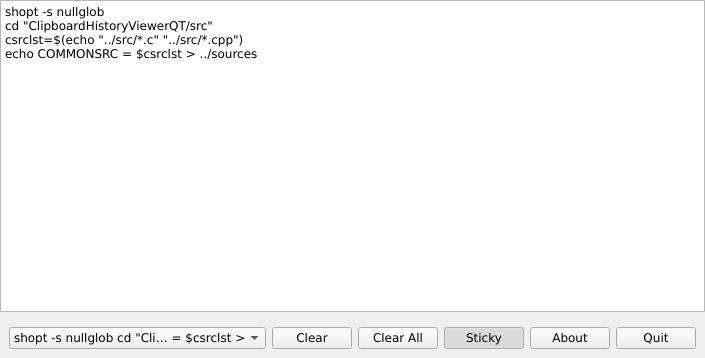

## ClipboardViewerQT
A QT based clipboard viewer and history.

  
  
  
  \
Every time you copy text or an image it will be added to the app.  
To retrieve a previous clip just select from the dropdown and the text or image will be recopied to the clipboad, then just paste as normal.  
Copying an image file now adds the image then the file uri.  
Toggling the 'Sticky' button will show the window on all desktops or not.  
  \
Compile with:  
```
./autogen.sh --prefix=/usr
make
sudo make install
```


